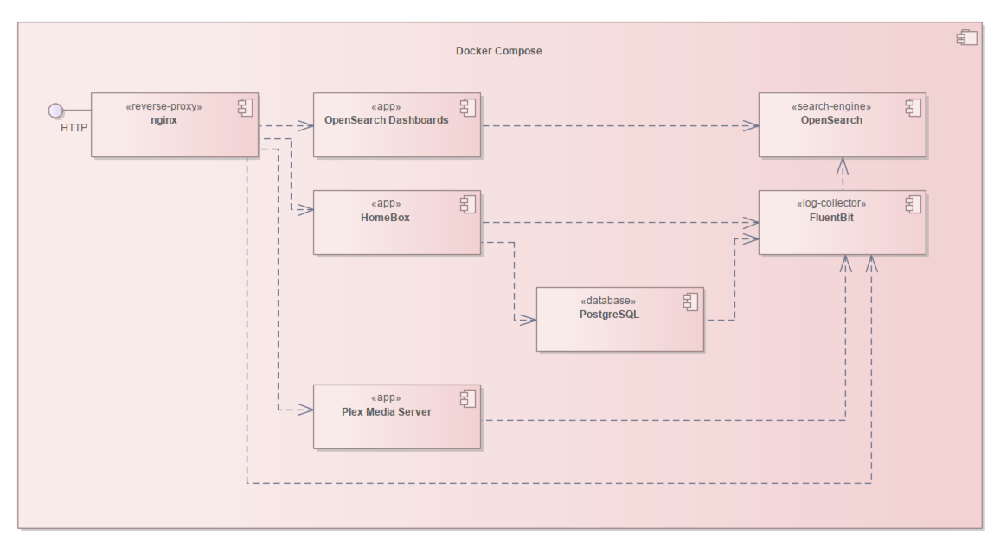

# Home Ecosystem

A personal, self-hosted home server stack – built for my needs and fun.

## ⚠️ Disclaimer

This project is a personal hobby setup created for my own home environment. It is not production-ready and may contain
experimental or incomplete features. Use it at your own risk, and adapt it carefully if you plan to run it in your own
environment.

## 🖥️ Hosted Applications

- [HomeBox](https://homebox.software/en/) – Manage and track your home inventory.
- [Plex Media Server](https://www.plex.tv) – Stream and organize your media library.
- [OpenSearch](https://opensearch.org) – Centralize, search, and analyze your logs and data.

## 📦 Additional Features

- [PostgreSQL](https://www.postgresql.org) – A robust relational database for HomeBox and other applications.
- [FluentBit](https://www.elastic.co/beats/filebeat) – Collects Docker container logs and forwards them to OpenSearch
  for centralized log management.
- [nginx](https://www.nginx.com) – A HTTP server acting as a reverse proxy to route traffic to the applications
  running on different ports based on the requested local domain (e.g., `homebox.home.local`, `plex.home.local`).

## 🎯 Coming Soon...

- [Home Assistant](https://www.home-assistant.io) – Automate and control your smart home and IoT devices.
- [AppDaemon](https://appdaemon.readthedocs.io/en/latest/) – Extend Home Assistant with custom apps.
- [Grafana](https://grafana.com) – Visualize and monitor your data.

## 🌟 Future Plans and Ideas

- _Backup & archival tools_ – Securely store your data with private, self-hosted backups.
- _Synchronization solutions_ – Envision seamless connections across major cloud ecosystems such as
  Apple iCloud, Google, and Microsoft Office.
- _Personal finance management tool_ – Explore ways to track your financial status, manage accounts, and organize
  spending.
- _Personal weather station_ – Measure local temperature, rainfall, wind, and other conditions; share your data with
  larger weather networks or platforms.

## 🏗️ Architecture

The platform is fully containerized using Docker Compose, making it easy to deploy and manage as a single unit. It 
relies on open-source and free solutions, ensuring flexibility and transparency. With minimal configuration, the system 
can be started and run effortlessly, providing a cohesive home server environment.

### Components Diagram

<!--suppress HtmlDeprecatedAttribute -->
<p align="center">
  
</p>

## 🔧 Setup Instructions

### Prerequisites

- A Linux-like operating system (e.g., Ubuntu, macOS, etc.)
- [Docker](https://www.docker.com) and [Docker Compose](https://docs.docker.com/compose/)

### Installation Steps

1. **Clone the Repository**

   ```bash
   git clone https://github.com/mihaly-farkas/home-ecosystem.git
   cd home-ecosystem
   ```

2. Set up environment variables by copying the example file and modifying it as needed:

   ```bash
    cp .env.example .env
   ```

   Be aware that Plex requires a temporary claim token for the initial setup.
   See the instructions in the `.env` file comments.

3. Start the Home Ecosystem stack:

   ```bash
   bin/start
   ```

4. Set up Plex using the direct IP address of your server (e.g., http://127.0.0.1:32400/web) for the initial
   configuration - it won't work if you try to access it through the nginx proxy until after the first setup.

5. Edit your `/etc/hosts` file (or equivalent) to map the local domains to your server's IP address:

   ```text
   127.0.0.1       homebox.home.local
   127.0.0.1       plex.home.local
   127.0.0.1       opensearch.home.local
   ```

## 🚀 Usage

### Start the Home Ecosystem stack

```bash
bin/start
```

After the containers are up and running, you can access the services using the following URLs:

- HomeBox: http://homebox.home.local
- Plex Media Server: http://plex.home.local
- OpenSearch: http://opensearch.home.local

### Stop the Home Ecosystem stack

```bash
bin/stop
```

### Backup PostgreSQL Database

```bash
bin/backup-postgres
```

[//]: # (TODO - Write a script to restore the PostgreSQL database from a backup. Truncate the tables, disable all triggers, etc...)

## ⚖️ License

This project is licensed under the [MIT License](LICENSE).
